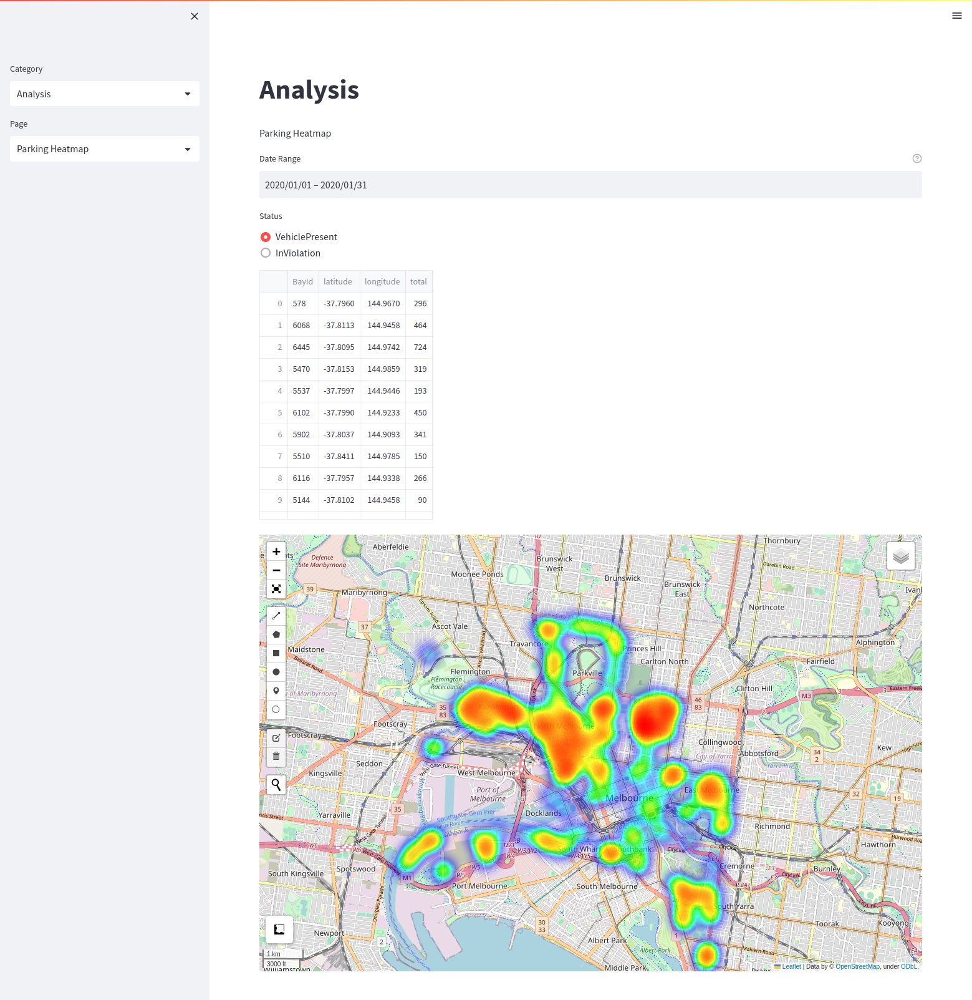
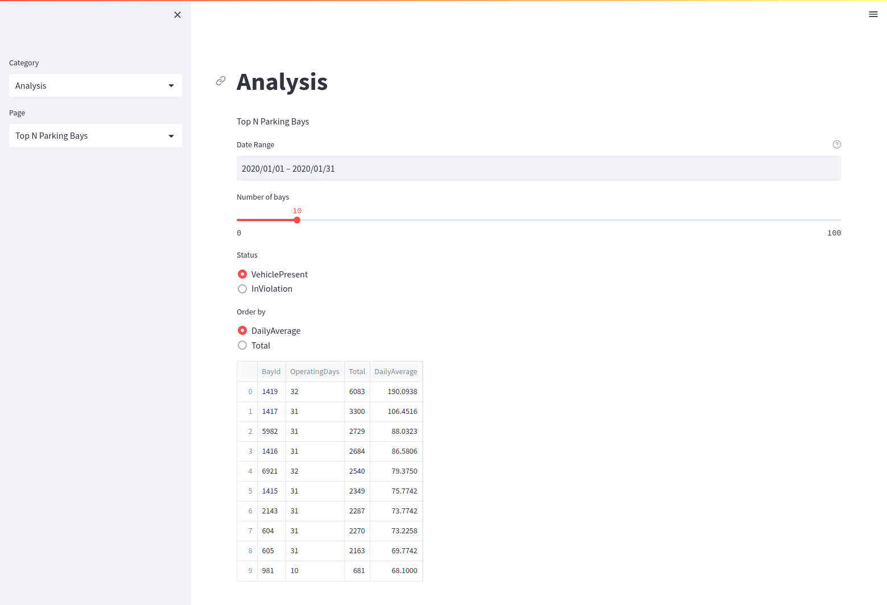
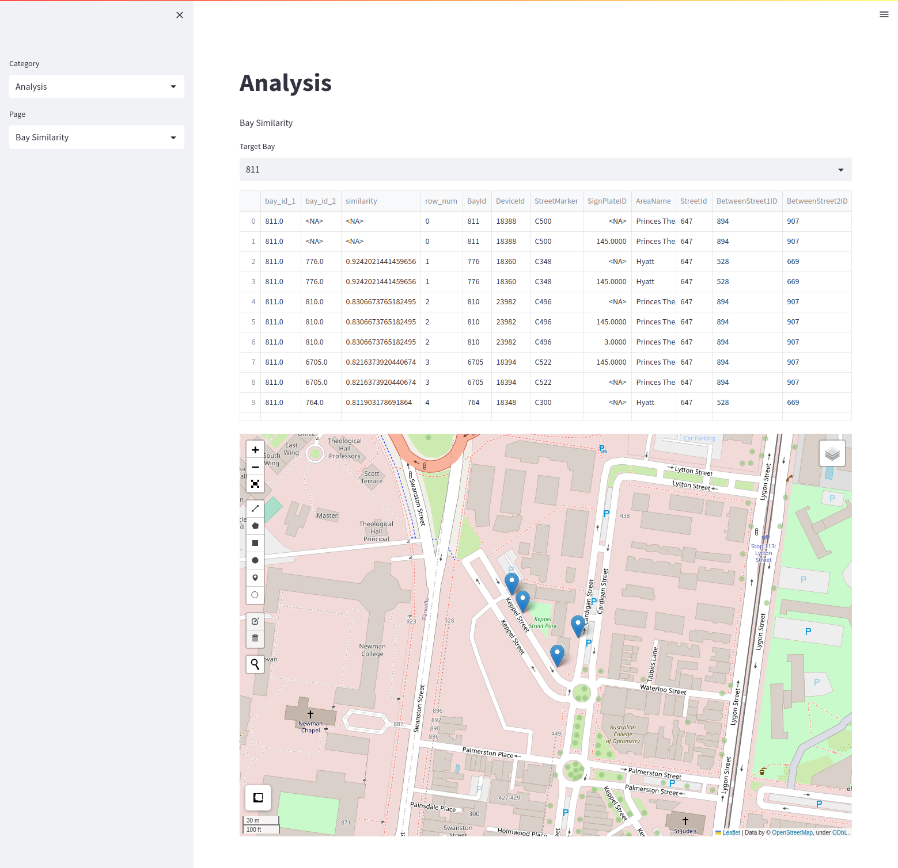

# Melbourne Parking Bay Model
This repository demonstrated multiple packages for data.
- Streamlit for data visualization
- Leafmap for data visualization
- Spark for large-scale data processing
- CSRGraph for graph data processing
- NodeVectors for graph embedding
- StableBaselines3 for reinforcement learning

## Data Visualization
### Heatmap for Parking Usage 
Pyspark is applied to measure the usage in the specific period

### Top N Parking Bays
Pyspark is applied to measure the usage in the specific period

### Graph Embedding for Parking Bay Similarity
The CSR Graph data is generated by Pyspark, the graph embedding is generated by the node2vec algorithm. The embedding similarity shows the similar parking bays on map.

## Graph Embedding
Details in `notebook/graph_embedding.ipynb`

## Reinforcement Learning
Details in `notebook/model_training.ipynb`
